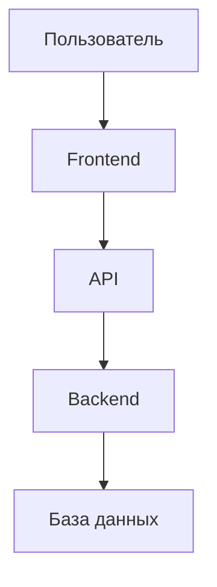

# 🎨 Визуализация архитектуры проекта Serenity

Этот каталог содержит файлы визуализации архитектуры проекта Serenity в различных форматах.

## 📁 Доступные файлы

### 1. `ARCHITECTURE_DIAGRAM.md` - Mermaid диаграммы
Основной файл с полной визуализацией архитектуры в формате Mermaid.

**Как использовать:**
- **GitHub/GitLab**: Диаграммы автоматически рендерятся
- **VS Code**: Установите расширение "Mermaid Preview"
- **Онлайн**: https://mermaid.live/ - вставьте код диаграммы
- **Draw.io**: Импортируйте как Mermaid диаграмму

### 2. `architecture.puml` - PlantUML диаграмма
Архитектура в формате PlantUML для профессионального документирования.

**Как использовать:**
- **PlantUML сервер**: https://www.plantuml.com/
- **VS Code**: Установите расширение "PlantUML"
- **IntelliJ IDEA**: Встроенная поддержка PlantUML
- **Онлайн редактор**: https://plantuml-editor.kkeisuke.com/

### 3. `architecture.json` - JSON спецификация
Структурированное описание архитектуры в формате JSON.

**Как использовать:**
- **Автоматизация**: Для генерации документации
- **Анализ**: Для инструментов анализа кода
- **Интеграция**: С системами управления архитектурой

## 🏗️ Что визуализировано

### 🎯 Основные компоненты:
- **Frontend Layer**: React компоненты, хуки, маршрутизация
- **Backend Layer**: PHP контроллеры, сервисы, middleware
- **Database Layer**: Структура таблиц и связи
- **API Layer**: REST endpoints и коммуникация

### 🔄 Потоки данных:
- От пользователя до базы данных
- Через все слои архитектуры
- С обработкой ошибок и аутентификацией

### 📊 База данных:
- ER-диаграмма всех таблиц
- Связи между сущностями
- Ключевые поля и типы данных

### 🚀 Технологии:
- Mindmap технологий
- Стек разработки
- Инструменты DevOps

## 🎨 Форматы визуализации

### Mermaid (рекомендуется)


### PlantUML
```
@startuml
actor User
User --> Frontend : использует
Frontend --> Backend : API calls
Backend --> Database : запросы
@enduml
```

### JSON спецификация
```json
{
  "architecture": {
    "layers": [
      {
        "name": "Frontend Layer",
        "components": [...]
      }
    ]
  }
}
```

## 🛠️ Рекомендуемые инструменты

### Бесплатные онлайн-инструменты:
- **Mermaid Live Editor**: https://mermaid.live/
- **PlantUML Server**: https://www.plantuml.com/
- **Draw.io**: https://app.diagrams.net/

### Расширения VS Code:
- **Mermaid Preview**
- **PlantUML**
- **Draw.io Integration**

### Десктопные приложения:
- **Visual Studio Code** с расширениями
- **IntelliJ IDEA** (встроенный PlantUML)
- **Draw.io Desktop**

## 📖 Легенда диаграмм

### Иконки компонентов:
- 👤 **Пользователь**: Внешний пользователь системы
- 🌐 **Браузер**: Веб-браузер
- 🎨 **Frontend**: Пользовательский интерфейс
- ⚙️ **Backend**: Серверная логика
- 🗄️ **Database**: База данных
- 🔄 **API**: Интерфейс программирования
- 🛡️ **Middleware**: Промежуточное ПО
- 🎯 **Controller**: Контроллер API
- 📊 **Service**: Бизнес-логика
- 📋 **Model**: Модель данных

### Цветовая схема:
- 🔵 **Frontend**: Синий (#E1F5FE)
- 🟣 **Backend**: Фиолетовый (#F3E5F5)
- 🟢 **Database**: Зеленый (#E8F5E8)
- 🟠 **API**: Оранжевый (#FFF3E0)

## 🎯 Советы по использованию

1. **Для презентаций**: Используйте Mermaid в GitHub README
2. **Для документации**: PlantUML файлы в репозитории
3. **Для анализа**: JSON спецификация для инструментов
4. **Для команд**: Делитесь диаграммами в общих чатах

## 📝 Обновление диаграмм

При изменении архитектуры проекта:
1. Обновите соответствующие файлы
2. Проверьте визуализацию во всех форматах
3. Зафиксируйте изменения в Git
4. Обновите документацию проекта

---

*Файлы визуализации архитектуры проекта Serenity* 🏗️✨


